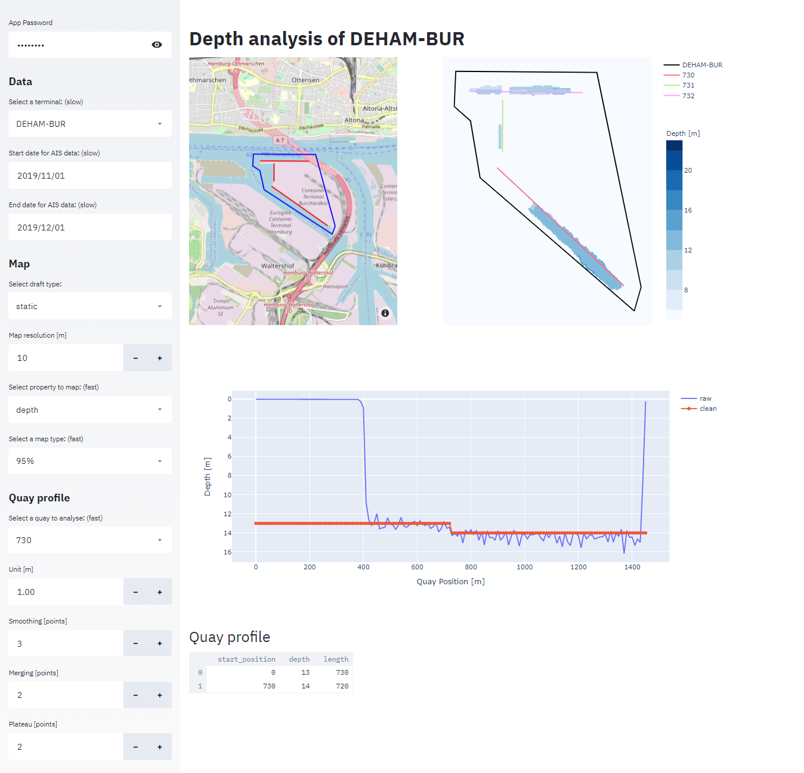

# Terminal depth analysis
## Graphical user interface
1. Insert password. Get from Sebastian
2. Select terminal of interest in dropdown menu. Wait for data to be loaded. The data range can be extended to improve \
the map quality at the cost of increased computation time.
3. Select how the map should be calculated 
    1. Draft Type: **static** to use draft of vessels while at berth. **dynamic** to use draft of vessels at all times    
    1. Resolution: Increase for finer details and slower computation
    2. Property to map: **Depth** or **count**
    3. Select how depth is calculated from drafts: **max** depth is the maximal of drafts observed. This is sensitive \
    to outliers. **95%** the 95-percentile of observed drafts this is more robust to outliers but will underestimate \
    the depth.
 4. Analyse quays
    1. Select the quay to analyse in dropdown menu. You can find the ID of the quay by hovering over the quay in the \
    map above.
    2. Expert Settings:
        1. Unit:
        2. Smoothing: 
        3. Merging :
        4. Plateau:
  5. Quay profile:
    


### Web app
https://terminal-depth.herokuapp.com/

### Local
The following environment variables must be set
```shell script
APP_PASSWORD
AIS_DATABASE_URL
AIS_TERMINAL_DATABASE_URL
```

Launch app with:
```shell script
streamlit run app.py
```

## Command line tool
The following environment variables must be set
```shell script
AIS_DATABASE_URL
AIS_TERMINAL_DATABASE_URL
```

```shell script
python -m main -t DEHAM-BUR -s 2019-11-01 -e 2019-12-01 
```
